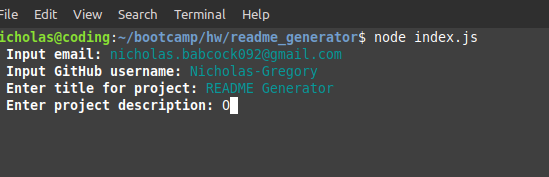

# README Generator
  
## Table of Contents
1. [Description](#Description)
2. [Installation](#Installation)
3. [Usage](#Usage)
4. [License](#License)
5. [Contributing](#Contributing)
6. [Tests](#Tests)
7. [Questions](#Questions)
## Description {#Description}
A simple command-line app for generating a professional README file

## Installation {#Installation}

## Usage {#Usage}

## License {#License}
  Apache License 2.0
## Contributing {#Contributing}

## Tests {#Tests}

## Questions {#Questions}
If you have additional questions, email us at [nicholas.babcock092@gmail.com](mailto:nicholas.babcock092@gmail.com) or reach out on [Github](https://github.com/Nicholas-Gregory).
